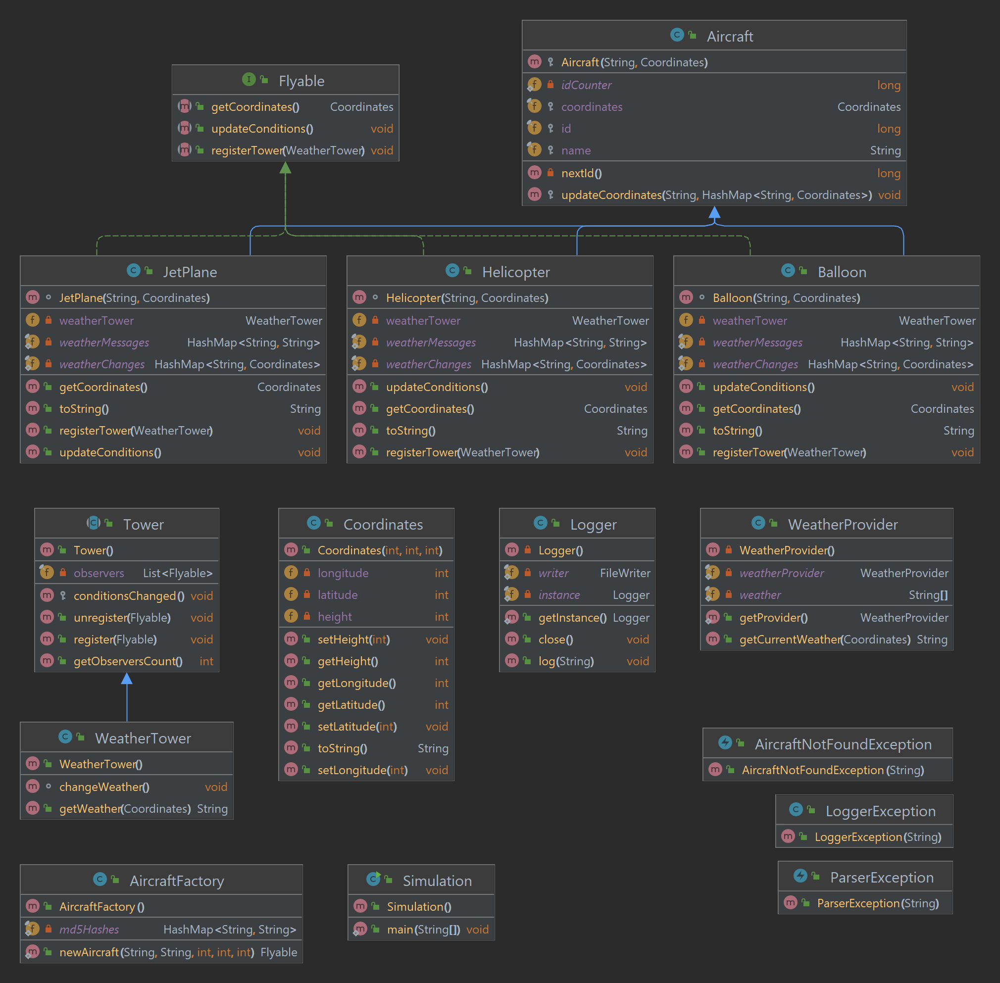

## Avaj Launcher

### About

Java program that simulates aircraft flying in the sky. The program reads a text file that contains the number of times the simulation should run and the different types of aircraft and their initial coordinates. The program then outputs the different steps and states of the aircraft during the simulation in a text file.

### Features

* Observer design pattern
* Factory design pattern
* Singleton design pattern
* Inheritance
* Polymorphism
* Exception handling
* File handling

### Scenario file rules

* The first line of the scenario file must contain a single integer, the number of times the simulation should run.
* Each following line describes an aircraft and its initial coordinates.
* The line is made of 5 arguments separated by spaces:
  * Aircraft type (Helicopter, JetPlane or Balloon)
  * Name
  * Longitude
  * Latitude
  * Height
  * The 5 arguments must be separated by spaces.
  * The longitude, latitude and height must be integers.


### Simulation rules

* The aircraft simulation stops when the altitude is 0 or less.
* The simulation stops when all aircraft have landed or the required number of simulation runs has been reached.
* The simulation stops when an error occurs. (invalid write to file, invalid scenario file, invalid aircraft type, invalid coordinates, etc.)

### How to run (on Linux / macOS)

1. Make sure you have JDK 1.8+ installed
2. Execute `bash run.sh` to compile and run the program with the default `scenario.txt` file
3. Execute `bash clean.sh` to remove the .class files and the output file

### How to run (on Windows)

1. Make sure you have JDK 1.8+ installed

2. Compile the program to create the .class files:

```bash
find * -name "*.java" > sources.txt
javac @sources.txt
```

3. Run the program with `java -classpath src/main/java/ com.admiralxy.avaj.Simulation scenario.txt` where `scenario.txt` is the path to the scenario file you want to use.


4. The output will be in a text file called `simulation.txt`

### UML Diagram of the program

